# 📌 Tarefa 2 - Revisão de Código e Protótipo: Aplicação de Boas Práticas

Nesta atividade, o objetivo principal foi revisar os códigos desenvolvidos para as aplicações Web, Desktop e Mobile feitas em grupo, aplicando boas práticas de programação e garantindo alinhamento com os protótipos visuais criados.

A prática de revisão de código e manutenção e essencial para garantir a vida útil de um software ou sistema, manutenção e padronização além de aproximar o produto final daquilo que foi projetado no briefing e protótipo

---

# 🖥️ Revisão do Código Web

Nesta fase iremos revisar o código desenvolvido para a aplicação web feita para o parque da alegria

## Protótipo Web da tela Home

Figma: https://www.figma.com/design/6q1rdoJvYbVv4Piu99aS8o/Parque-de-Divers%C3%A3o?node-id=0-1&t=v91pa6maX8PiGTSq-1 

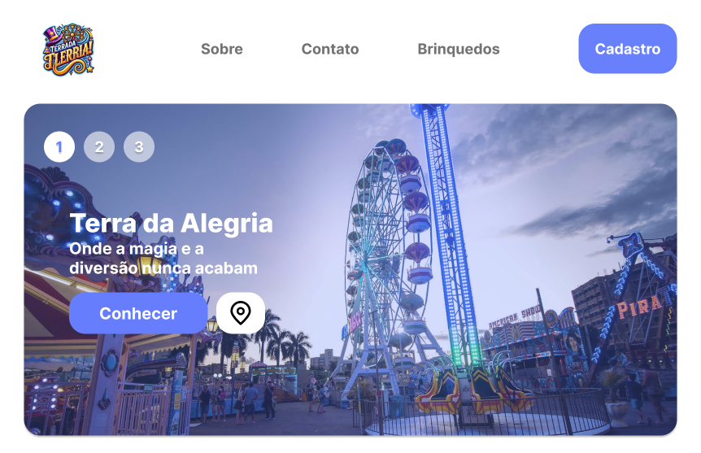

## Código desenvolvido

Link: https://github.com/mitsboydesk17/UC9/blob/main/home.py

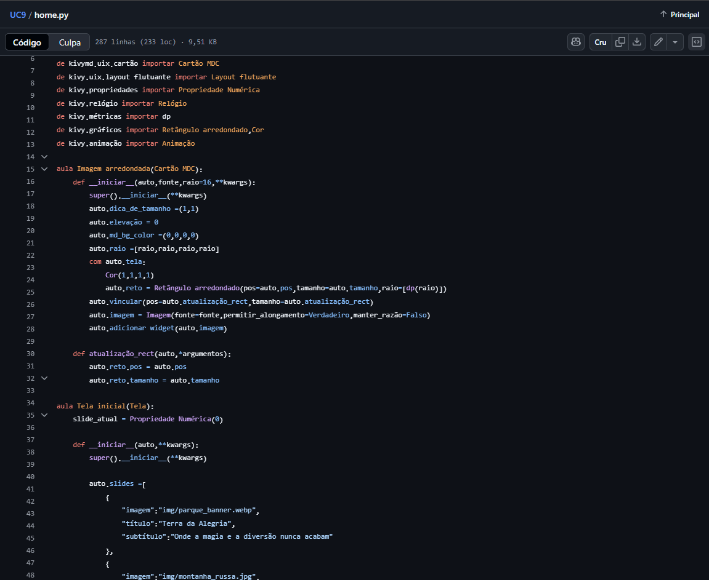

## **Comentários de melhoria**

- **Trocar `Screen` por `MDScreen`** → melhor integração com o KivyMD.
- **Separar `RoundedImage` em arquivo próprio** → deixa o código mais modular.
- **Centralizar cores em tema global** → facilita futuras mudanças de paleta.
- **Padronizar botões e espaçamentos** → melhora a consistência visual.
- **Ajustar responsividade com mais breakpoints** → garante adaptação em telas menores.

### Conclusão

As melhorias propostas tornam o código mais **organizado, modular e fácil de manter**, além de garantir **consistência visual** e **melhor experiência do usuário**. A aplicação dessas práticas contribui para um sistema mais **profissional, acessível e escalável**, facilitando tanto futuras atualizações quanto a colaboração entre diferentes desenvolvedores.

---

# 👨‍💻 Revisão do Código Desktop

Na parte desktop desenvolvemos um código de login, onde a pessoa iria entrar com e-mail e senha

## Protótipo da tela Desktop

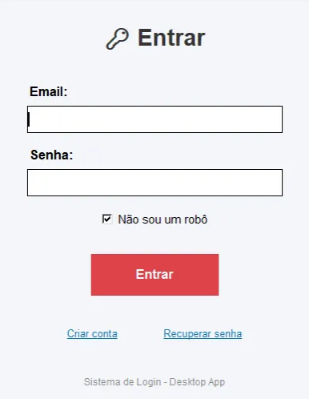

## Código desenvolvido

[https://github.com/christianexp19/PROJEOTSKIVY/blob/main/perfil.py/main.py](https://github.com/christianexp19/PROJEOTSKIVY/blob/main/perfil.py/main.py)

## **Comentários de melhoria**

- Implementar **placeholder real** nos campos de entrada → melhora a experiência do usuário e evita envio de valores inválidos.
- **Centralizar a janela** dinamicamente → garante que a tela abra no centro do monitor, deixando o layout mais profissional.
- Adicionar **feedback de erro interno** com `Label` → evita pop-ups constantes e mantém o fluxo do usuário mais suave.
- Melhorar **segurança da senha** → remover placeholder da senha ao focar e usar hash se for armazenada.

### Conclusão

A implementação deste sistema de login demonstra como boas práticas de programação e design podem tornar uma aplicação **mais organizada, modular e intuitiva**. A separação clara de funções, o uso de componentes reutilizáveis e a padronização visual garantem **consistência e manutenção simplificada**. 

---

# 📱 Revisão do Código Mobile

Na parte Mobile, revisamos o código desenvolvido para garantir que estivesse alinhado com os critérios passados na atividade.

## Protótipo da tela Mobile

## Código desenvolvido

https://github.com/Ennzo17/projetos_aprendizado/blob/main/UC8/App%20de%20Sugest%C3%A3o%20de%20Filme/filme.py

## **Comentários de melhoria**

### **1. Melhorias de Interface e Design**

- **Implementar um tema de cores moderno e harmonioso**
    - Esquema de cores com tons mais atuais e contrastantes
    - Paleta consistente em todos os elementos da interface
- **Redesign do cabeçalho**
    - Adicionar gradiente ou cor sólida mais atraente
    - Implementar cantos arredondados na parte inferior
    - Incluir sombra sutil para profundidade
- **Botões personalizados com efeitos visuais**
    - Criar botões com cantos arredondados
    - Adicionar efeitos de hover e press
    - Implementar animações de feedback ao clicar
- **Melhorar os campos de entrada**
    - Placeholders mais descritivos
    - Estilos visuais consistentes
    - Efeitos de foco mais evidentes

### **2. Melhorias de Funcionalidade**

- **Sistema de favoritos**
    - Permitir que usuários marquem filmes como favoritos
    - Visualização separada para filmes favoritados
    - Persistência de favoritos entre sessões
- **Busca e filtros**
    - Campo de busca por nome do filme
    - Filtros por década de lançamento
    - Filtros por avaliação (se implementado)
- **Sistema de avaliação**
    - Permitir que usuários avaliem filmes com estrelas
    - Exibir avaliação média para cada filme
    - Ordenar sugestões por avaliação
- **Listas personalizadas**
    - Criar listas temáticas personalizadas
    - Compartilhar listas com outros usuários
    - Explorar listas criadas pela comunidade

### **3. Melhorias de Experiência do Usuário**

- **Transições e animações**
    - Animações suaves entre telas
    - Efeitos de carregamento para imagens
    - Transição ao alternar entre sugestões
- **Feedback visual melhorado**
    - Tooltips e dicas contextuais
    - Mensagens de status mais claras
    - Confirmações para ações importantes
- **Histórico visualmente aprimorado**
    - Visualização em grid com capas dos filmes
    - Informações mais completas em cada item
    - Filtros para o histórico (por data, gênero)
- **Sistema de recomendação inteligente**
    - Aprendizado das preferências do usuário
    - Sugestões baseadas no histórico de visualização
    - Recomendações surpresa com base em padrões

### **4. Melhorias de Performance**

- **Cache de imagens**
    - Implementar sistema de cache para capas de filmes
    - Placeholders durante o carregamento
    - Compressão inteligente de imagens
- **Otimização de carregamento**
    - Carregamento lazy para listas longas
    - Paginação para o histórico muito extenso
    - Pré-carregamento de sugestões prováveis
- **Gestão de memória**
    - Limpeza automática de cache
    - Liberação de recursos não utilizados
    - Otimização para dispositivos com pouca memória

### **5. Recursos Adicionais**

- **Integração com APIs de filmes**
    - Conexão com TMDB ou outras APIs para dados atualizados
    - Trailer incorporado para cada filme
    - Informações adicionais (elenco, diretor, sinopse)
- **Social features**
    - Compartilhar sugestões em redes sociais
    - Ver o que amigos estão assistindo
    - Desafios e conquistas relacionadas a filmes
- **Modo offline**
    - Funcionalidades básicas disponíveis offline
    - Sincronização quando conexão restaurada
    - Download de informações para acesso offline
- **Personalização da interface**
    - Temas claros e escuros
    - Tamanho de texto ajustável
    - Layouts alternativos para diferentes preferências

### **6. Melhorias Técnicas**

- **Refatoração do código**
    - Separação em módulos especializados
    - Padrões de design como MVC ou MVVM
    - Melhor gestão de estado da aplicação
- **Testes**
    - Testes unitários para funções críticas
    - Testes de interface para fluxos principais
    - Testes de desempenho e carga
- **Documentação**
    - Comentários no código
    - Documentação de arquitetura
    - Guia de contribuição para desenvolvedores

### **7. Melhorias de Acessibilidade**

- **Suporte a leitores de tela**
    - Textos descritivos para elementos visuais
    - Navegação por teclado
    - Atalhos acessíveis
- **Design inclusivo**
    - Cores com contraste adequado
    - Tamanhos de fonte ajustáveis
    - Layout responsivo para diferentes tamanhos de tela

### **8. Preparação para Publicação**

- **Icone e splash screen personalizados**
    - Design profissional para o ícone do app
    - Tela de inicialização temática
    - Versões para diferentes densidades de tela
- **Metadados da loja de aplicativos**
    - Descrição atraente
    - Capturas de tela profissionais
    - Vídeo de demonstração
- **Análises e métricas**
    - Integração com ferramentas de analytics
    - Coleta de feedback dos usuários
    - Monitoramento de crash reports

## Conclusão

O desenvolvimento do nosso aplicativo de sugestão de filmes representou uma jornada significativa de transformação digital, onde partimos de uma funcionalidade básica para construir uma experiência cinematográfica verdadeiramente envolvente. Implementamos um design visualmente atraente com uma paleta de cores harmoniosa que cria immediateamente uma conexão emocional com os usuários, enquanto elementos de interface arredondados e feedback visual intuitivo garantem uma navegação fluida e agradável. Ampliamos substancialmente o valor da plataforma ao incorporar um sistema personalizado de favoritos, mecanismos de busca inteligente e um sistema de avaliação que permite aos usuários registrar suas impressões sobre cada filme. Otimizamos o desempenho técnico com soluções eficientes de cache de imagens e carregamento dinâmico, assegurando respostas ágeis mesmo em dispositivos móveis mais limitados. Priorizamos a inclusão digital através de recursos de acessibilidade robustos, garantindo que nossa plataforma seja acolhedora para todos os tipos de usuários. Esta evolução estratégica posiciona o aplicativo não apenas como uma ferramenta de sugestão, mas como um companheiro inteligente para descobrimento cinematográfico, abrindo caminho para futuras integrações com APIs especializadas e algoritmos de recomendação cada vez mais sofisticados, sempre com o objetivo final de conectar pessoas com histórias que realmente importam para elas.

---

# **📌 Aplicando as Boas Práticas de Programação**

Ao revisar o código, certificamos de fazer melhorias no código como nomes de variáveis e funções descritivos, organizamos o código e indentamos ele para garantir organização, remoção de códigos duplicados e desnecessários

Link:https://github.com/mitsboydesk17/UC9/blob/main/auth.py

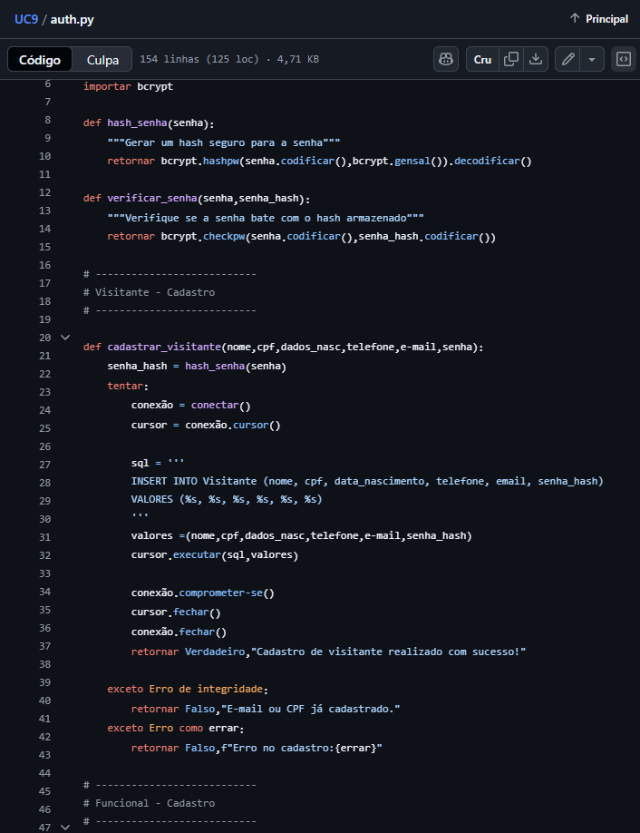

# Boas Práticas aplicadas no código

**Nomes de variáveis e funções mais descritivos**

- Todas as funções e variáveis foram renomeadas para transmitir claramente sua finalidade.
- Exemplos:

`hash_senha` → `gerar_hash_senha` `verificar_senha` → `verificar_hash_senha`

Variáveis como `x`, `valores` ou `senha_hash` foram mantidas ou ajustadas para serem claras quanto ao seu conteúdo.

Isso facilita a leitura e manutenção do código, tornando-o mais intuitivo para outros desenvolvedores.

- Código organizado e recuado
- Remoção de código desnecessário
- Comentários explicativos

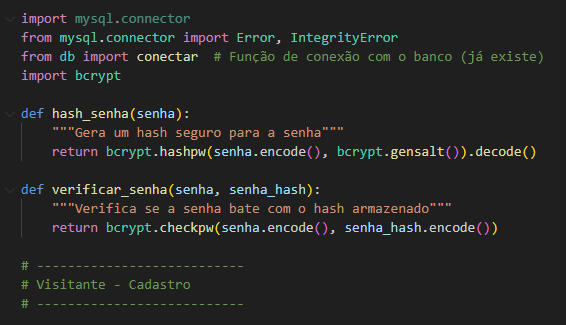

---

# ➕ Verificando Protótipos Visuais

A seguir iremos ver o protótipo desenvolvido no Figma onde ele apresenta uma interface muito limpa e moderna com todos os elementos cuidadosamente posicionados e pensando no usuário alguns pontos que se destacam:

- Cores e paleta visual
- Componentes bem organizados e separados
- Tipografia
- Detalhes de interação
- Layout responsivo e planejado

# Protótipo & Links

Figma: https://www.figma.com/design/6q1rdoJvYbVv4Piu99aS8o/Parque-de-Divers%C3%A3o?node-id=0-1&t=v91pa6maX8PiGTSq-1 

# Implementação em código

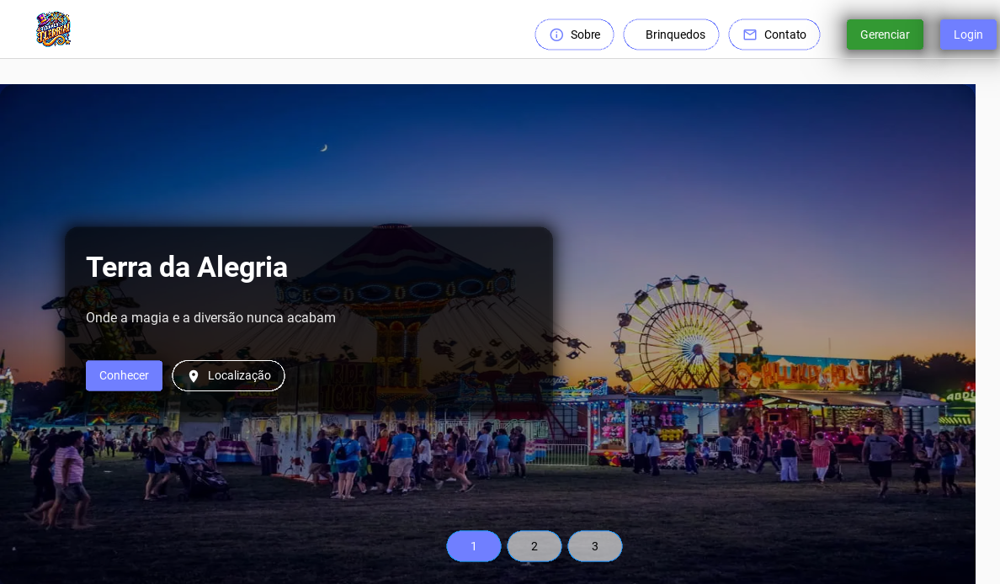

Ao tentar reproduzir o protótipo no código com ( Python/Kivy, KivyMd ) algumas limitações técnicas foram identificadas como:

- Recursos de estilização limitados
- Controle do layout restrito
- Tipografia e fontes
- Interações avançadas

Portanto, apesar de o código reproduzir **a estrutura, cores principais e funcionalidades do protótipo**, a **aparência final não chega a refletir totalmente o nível de detalhamento visual do Figma**. Isso é natural quando a ferramenta de implementação possui limitações em relação à liberdade visual que um protótipo de design oferece.

---

# 📌 Introdução

O objetivo desta atividade foi revisar e aprimorar os códigos desenvolvidos nos projetos We, Desktop e Mobile, aplicando boas práticas de programação e estrutura.

A aplicação dessas práticas é fundamental para garantir que o código seja mais legível, organizado se seguro, além de facilitar futuras manutenções e adaptações ao sistema.

## Protótipo Web da tela Home

Figma: https://www.figma.com/proto/r1VNwDxNwtfsOa0gCzOYP1/Projeto-Integrador-12---Sistema-Agenda-ai--?node-id=861-423&t=se5sZle8yFX5r99n-0&scaling=scale-down&content-scaling=fixed&page-id=3%3A2&starting-point-node-id=861%3A423&show-proto-sidebar=1

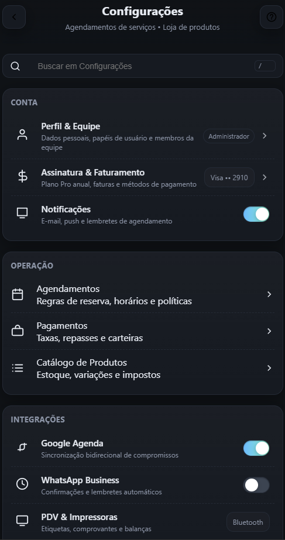

## Código Atualizado

[Link: home.py](https://github.com/mitsboydesk17/agenda_ai/blob/main/Configuracao.zip)

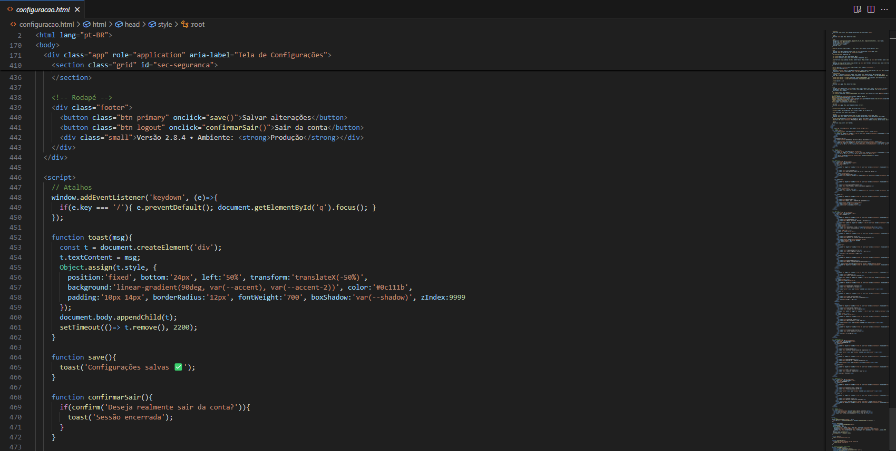

## **Comentários de melhoria**

- Estrutura semântica e acessibilidade

**Melhoria:**

Facilita a navegação para pessoas com deficiência visual.

**Benefício:**

Aumenta a acessibilidade e conformidade com boas práticas de UX inclusivo.

- Hierarquia clara de títulos

**Melhoria:**

Uso correto de h1

para o título principal e h2

para subtítulos de seções.

**Benefício:**

Permite leitura semântica do conteúdo e melhora SEO.

- Layout responsivo com Grid

---

# 👨‍💻 Protótipo Web Desktop

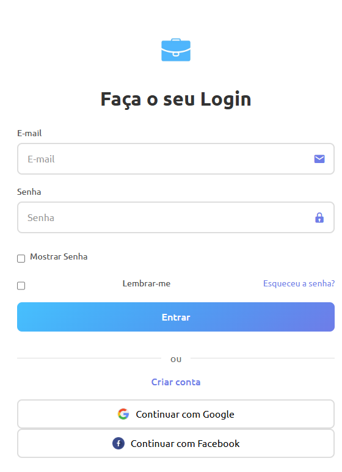

## Código desenvolvido

[https://github.com/mitsboydesk17/agenda_ai/blob/main/telas_login_cadastro.zip](https://github.com/mitsboydesk17/agenda_ai/blob/main/telas_login_cadastro.zip)

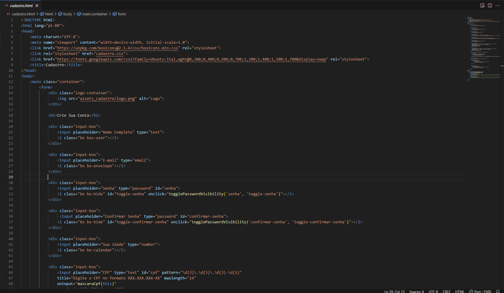

## **Comentários de melhoria**

### 1. **Estrutura semântica**

- Uso de `<main>` e `<form>` garante que a página seja semanticamente organizada.
- Benefício: Ajuda na acessibilidade e facilita a leitura por leitores de tela.

---

### 2. **Cabeçalho e título**

- `<h1>Crie Sua Conta</h1>` define o título principal da página.
- Benefício: Melhora SEO e fornece hierarquia clara do conteúdo.

---

### 3. **Organização dos inputs**

- Cada `<input>` está dentro de uma `
` com um ícone correspondente.
- Benefício: Layout consistente e fácil de estilizar, melhor experiência do usuário.

---

# 📱 Protótipo da tela Mobile

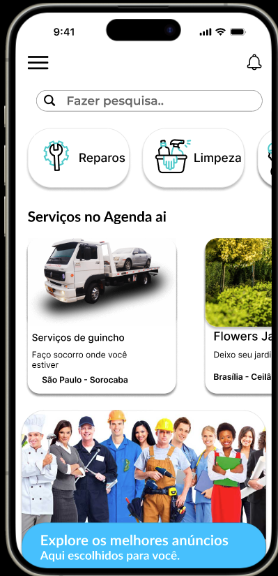

## Código desenvolvido

[https://github.com/mitsboydesk17/agenda_ai/blob/main/app.tsx](https://github.com/mitsboydesk17/agenda_ai/blob/main/app.tsx)

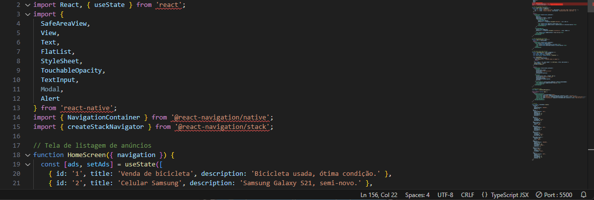

## **Comentários de melhoria**

- **FlatList:** melhoria de performance para listas grandes, evitando renderização desnecessária.
- **TouchableOpacity em cards:** aumenta a usabilidade, permitindo que o usuário toque para ver detalhes.
- **Validação de campos:** previne envio de dados vazios, melhorando UX.
- **Uso de SafeAreaView:** evita que elementos fiquem escondidos em áreas não seguras (como notch em iPhones).

**🙂 Integrantes do Grupo**

Link repositorio: https://github.com/mitsboydesk17/agenda_ai

- Júlio César
- Vitória Beatriz
- Ennzo Gabriel
- Davi Moulin
- Christian
- Sarah Dyovanna